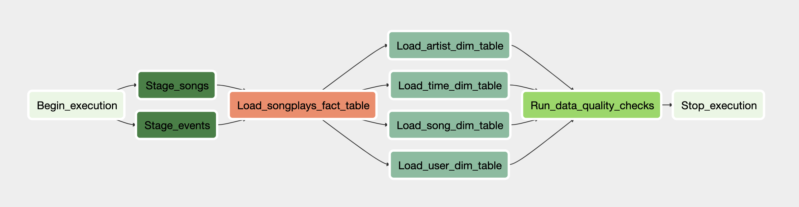

# Data Warehouse with Airflow

This is an upgrade using Airflow as a workflow management tool based on [my previous project](https://github.com/wctjerry/Data-Warehouse). 

## Project Description

An imaginary music streaming company, Sparkify, has decided that it is time to introduce more automation and monitoring to their data warehouse ETL pipelines and come to the conclusion that the best tool to achieve this is Apache Airflow.

I will work as a data engineer to create high grade data pipelines that are dynamic and built from reusable tasks, can be monitored, and allow easy backfills. They have also noted that the data quality plays a big part when analyses are executed on top the data warehouse and want to run tests against their datasets after the ETL steps have been executed to catch any discrepancies in the datasets.

## Roadmap



This project consists of three major steps:

1. Extract from a source (in S3) to a destination (in Redshift) for staging
2. Transform the data structure and load into analytics tables
3. Execute some quality checks and evaluate the data quality

### Step One: Staging

It often requires less code to perform ETL without staging data from sources, but pipelines without staging will have a few pitfalls:

* Debug. It's difficult to debug when some unexpected quality issues happen. Without staging tables, you have to rerun the whole pipeline, which is super time-consuming.
* Performance. Sometimes you will have multiple data sources, not only AWS S3, but also multiple different types of databases, or even calling external APIs. Re-run pipelines (and always including backfills) tends to have performance issues.
* Data availability. Sometimes you don't always have access to source data (access control or performance consideration). Without staging tables, it becomes impossible to re-execute your data pipelines.

So based on above discussions, our first step is to stage our source data. 

#### Datasets

The source data resides in S3 and needs to be processed in Sparkify's data warehouse in Amazon Redshift. The source datasets consist of JSON logs that tell about user activity in the application and JSON metadata about the songs the users listen to.

- Log data: `s3://udacity-dend/log_data` (Log data json path: `s3://udacity-dend/log_json_path.json`)
- Song data: `s3://udacity-dend/song_data`

##### Log Dataset

The log dataset consists of log files in JSON format. It is fake and generated by an event simulator based on above song dataset and some random configuration settings.

The log files in the dataset are partitioned by year and month. For example, here are filepaths to two files in this dataset.

```
log_data/2018/11/2018-11-12-events.json
log_data/2018/11/2018-11-13-events.json
```

This is a great signal that the pipeline could apply *incremental insert* when loading into the staging table: In every logical date, we only need to check and copy a single json file by the path of `log_data/{{execution_year}}/{{execution_month}}/{{execution_date}}-events.json`. There is no need to check other files or folders, which is very performance effective. A side benefit of this partition strategy is that every log file (for example: 2018-11-01-events.json) has similar size, which will take advantage of Amazon Redshift's parallel loading when executing a full copy. It performs much better than copying from a single large file.

Below is an example of what the data looks like in a log file:


##### Song Dataset

The song dataset is a subset of real data from the Million Song Dataset. Each file is in JSON format and contains metadata about a song and the artist of that song. The files are partitioned by the first three letters of each song's track ID. For example, here are filepaths to two files in this dataset.

```
song_data/A/B/C/TRABCEI128F424C983.json
song_data/A/A/B/TRAABJL12903CDCF1A.json
```

And below is an example of what a single song file, TRAABJL12903CDCF1A.json, looks like.

```
{"num_songs": 1, "artist_id": "ARJIE2Y1187B994AB7", "artist_latitude": null, "artist_longitude": null, "artist_location": "", "artist_name": "Line Renaud", "song_id": "SOUPIRU12A6D4FA1E1", "title": "Der Kleine Dompfaff", "duration": 152.92036, "year": 0}
```

In most production-grade applications, the song records will have a few datestamps to identify at least created_date/modified_date, which is a good signal to apply incremental insert when loading songs into a staging table. For every logical date,

```
If execution_date = created_date:
		insert the record
elif execution_date = modified_date:
		update the record
		
```

Things get a little bit complicated if a source deletes some records. There are a few different situations:

* If you are lucky enough that the source has recorded deleted information (e.g.: which was deleted and when), then you can align your destination with the source accordingly
* If for some auditing reasons, a destination should keep all the records even if some are deleted in the source, then you don't need to do anything
* If a destination should be aligned with a source, and there is no flags for deleting, then you will have to go through every records and see if there are some records deleted in the source. you might also find a simple truncate and copy as a much easier approach under this situation

Regarding to this song dataset, we are not lucky enough to have datestamps to identify newly added, updated, and deleted records. As such, truncate and copy will be an ideal simple and clean choice.

#### StageToRedshiftOperator

I've created a customized operator `StageToRedshiftOperator` to abstract the common functionality between staging log data and songs data. `table` and `s3_path` are the key variables to differentiate two separate tasks. The pipeline workflow is scheduled daily, so when staging log data, the `s3_path` will point to a corresponding log file with Jinja Templating.


### Step Two: Transformation

After staging the source data, we will then extract from staging tables and load extracted data into anaytics tables for future analytical queries. In this case, we are applying Star Schema with `songplay` event records as fact table, and `user`, `songs`, `artists` and `time` as dimension tables. This is similar to the design in my previous project. 

The fact table will continuously (sometimes exponentially) grow as new events generate every single day. A truncate and insert strategy will eventually cuase performance issues at some point in the future. As such, we decide not to touch original records in the fact table, but only those newly added ones.

On the other hand, dimensional tables will grow much slower than fact tables (that's one of the beauties of Star Schema), so it is usually acceptable to apply a truncate and insert strategy. This is a much cleaner approach especially in this project due to defect in our songs dataset discussed above.

#### LoadFactOperator and LoadDimensionOperator

Two customized operators are created to facilitate the load of fact and dimension tables respectively. The difference is that `LoadDimensionOperator` will delete the records before inserting extracted data.

### Step Three: Data Quality Check

Testing data quality early and often is always a good practice. Quality checks could be as simple as count the newly added records or as complex as anomaly detection. In this case, we will basically check:

* If the number of records in the fact and dimension tables is greater than zero
* If the number of newly added records in the fact table greater than zero
* If the number of newly added records falls within +- 75% of the average of previous seven days